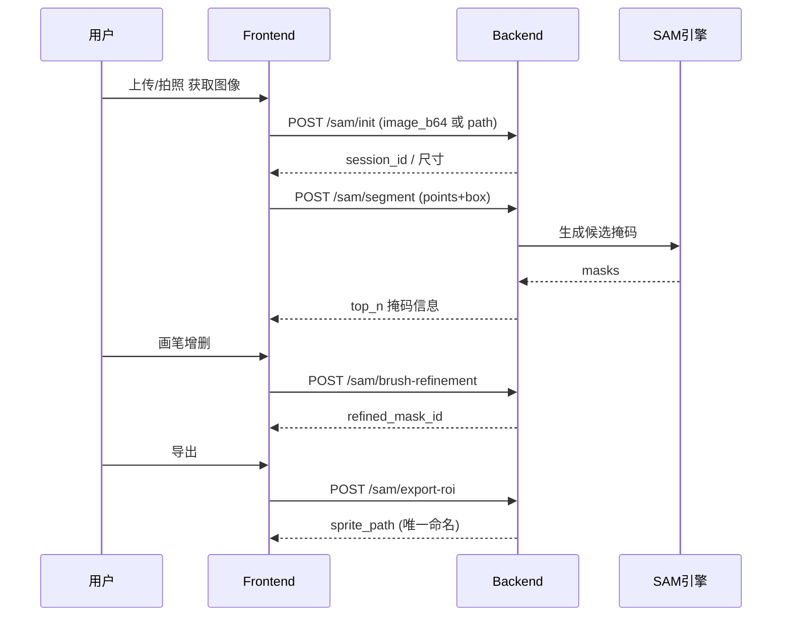
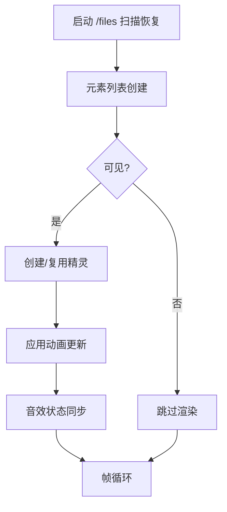

# Interactive Forest 项目架构分析 🏗️

## 📊 项目概览

Interactive Forest 是一个结合AI图像分割和互动可视化的创新项目，将儿童画作转化为动态的森林生态系统。

### 技术栈架构

```text
┌─────────────────┐    ┌─────────────────┐    ┌─────────────────┐
│   Frontend      │    │   Backend       │    │   AI Models     │
│                 │    │                 │    │                 │
│ Electron        │◄───┤ FastAPI         │◄───┤ SAM (Meta)      │
│ React           │    │ Python 3.8+     │    │ OpenCV          │
│ TypeScript      │    │ Uvicorn         │    │ NumPy           │
│ PIXI.js         │    │ Pydantic        │    │ Pillow          │
│ Vite            │    │ CORS Middleware │    │                 │
└─────────────────┘    └─────────────────┘    └─────────────────┘
```text

## 🎯 核心功能模块

### 1. 图像分割服务 (Backend)

**位置**: `apps/cv_service/`

**核心组件**:

- **SAM引擎** (`services/SAM.py`, `services/sam_engine.py`)
  - Meta的Segment Anything Model集成
  - 支持点击、框选、多点分割
  - GPU加速处理
  
- **会话管理** (`app/main.py`)
  - 基于UUID的会话隔离
  - 内存缓存编码结果
  - 自动清理临时文件

- **图像处理** (`services/postprocess.py`, `services/utils.py`)
  - 掩码后处理优化
  - ROI提取和导出
  - 透明背景PNG生成

**API架构（统一 /sam 模型）**:

```text
GET  /health                        # 健康检查
POST /sam/init                      # 初始化并完成编码 (image_path | image_b64)
GET  /sam/sessions                  # (调试) 当前活动 session 列表
POST /sam/segment                   # 生成候选掩码 (points + labels + box + top_n)
POST /sam/brush-refinement          # 画笔增删迭代精修掩码
GET  /sam/mask/{session_id}/{mask}  # 获取掩码 PNG
POST /sam/export-roi                # 导出透明 PNG (feather/roi_box/roi_index)
GET  /assets/list                   # 列出导出精灵 (seg_*.png)
DELETE /assets/delete               # 删除指定精灵文件
```text

### 2. 桌面应用 (Frontend)

**位置**: `apps/desktop/`

**架构层次**:

```text
Electron主进程 (main.js)
├── 窗口管理和生命周期
├── 文件系统访问
└── 进程间通信

React渲染进程 (renderer/)
├── 路由系统 (main.tsx)
├── 编辑器页面 (pages/Editor.tsx)
├── 舞台页面 (pages/Stage.tsx)
├── API通信层 (api.ts)
└── 组件库 (components/)
```

**关键模块**:

- **编辑器 (Editor.tsx)**
  - 图片上传和预览
  - 交互式分割工具
  - 实时掩码预览
  - 结果导出功能

- **森林舞台 (Stage.tsx)**
  - PIXI.js图形引擎
  - 视频背景播放
  - 元素动画系统
  - 音效管理
  - 拖拽交互

## 🔄 数据流架构

### 1. 分割处理流程（序列图）



### 2. 森林渲染流程（流程图）



### 3. 动画更新示例

```typescript
type AnimationType = 'sway' | 'fly' | 'move' | 'idle'
function updateAnimation(e: ElementItem, t: number) {
  switch (e.animation.type) {
    case 'sway': // 正弦横移+轻旋转
      break
    case 'fly':  // 波浪 y 偏移 + x 前进
      break
    case 'move': // 关键帧插值 pos/scale/rot/alpha
      break
    default:
      break
  }
}
```text

### 4. 关键状态片段

```typescript
interface SegSession {
  sessionId?: string
  rois: RoiBox[]
  activeRoi?: number
  points: {x:number;y:number;label:0|1}[]
  candidates: MaskCandidate[]
  refinedMaskId?: string
}

interface ElementItem {
  id: string
  file: string // seg_*.png
  url: string  // /files/seg_*.png
  visible: boolean
  animation: AnimationConfig
  sound?: SoundConfig
}
```

## 📂 文件组织结构

### 后端服务结构

```
apps/cv_service/
├── app/                    # FastAPI应用
│   ├── main.py            # API路由定义
│   ├── schemas.py         # 数据模型
│   ├── models/            # SAM模型文件
│   └── routers/           # 分模块路由
│       ├── assets.py      # 资源管理
│       └── segment.py     # 分割功能
├── services/              # 核心业务逻辑
│   ├── SAM.py            # SAM模型封装
│   ├── sam_engine.py     # 分割引擎
│   ├── postprocess.py    # 后处理
│   └── utils.py          # 工具函数
└── assets/               # 临时文件存储
```

### 前端应用结构

```
apps/desktop/
├── electron/             # Electron主进程
│   ├── main.js          # 主进程入口
│   └── preload.js       # 预加载脚本
├── renderer/            # React渲染进程
│   ├── src/
│   │   ├── main.tsx     # 应用入口
│   │   ├── App.tsx      # 根组件
│   │   ├── api.ts       # API通信
│   │   ├── types.ts     # 类型定义
│   │   ├── pages/       # 页面组件
│   │   └── components/  # 通用组件
│   └── public/          # 静态资源
│       ├── video/       # 背景视频
│       └── audio/       # 音效文件
└── package.json         # 依赖配置
```

## 🔧 关键技术实现

### 1. SAM模型集成

**模型加载**:

```python
class SAMEngine:
    def __init__(self, model_path: str):
        self.device = torch.device("cuda" if torch.cuda.is_available() else "cpu")
        self.sam = sam_model_registry["vit_h"](checkpoint=model_path)
        self.sam.to(device=self.device)
        self.predictor = SamPredictor(self.sam)
```

**编码优化**:

- 图片预处理和缓存
- GPU内存管理
- 批量处理支持

### 2. 实时交互渲染

**PIXI.js集成**:

```typescript
// 舞台初始化
const app = new PIXI.Application({
    width: window.innerWidth,
    height: window.innerHeight,
    backgroundColor: 0x000000,
    antialias: true
});

// 元素精灵管理
interface ForestElement {
    id: string;
    sprite: PIXI.Sprite;
    animation: AnimationConfig;
    sound: HTMLAudioElement;
}
```

**动画系统**:

```typescript
// 动画类型定义
type AnimationType = 'sway' | 'fly' | 'move';

// 动画更新循环
app.ticker.add((delta) => {
    elements.forEach(element => {
        updateAnimation(element, delta);
    });
});
```

### 3. 会话状态管理

**后端会话**:

```python
class SessionManager:
    def __init__(self):
        self.sessions: Dict[str, SessionData] = {}
    
    def create_session(self) -> str:
        session_id = str(uuid.uuid4())
        self.sessions[session_id] = SessionData()
        return session_id
```

**前端状态**:

```typescript
interface AppState {
    currentSession: string | null;
    uploadedImage: string | null;
    masks: MaskResult[];
    selectedMask: number | null;
}
```

## 🚀 性能优化策略

### 1. 后端优化

**模型加载优化**:

- 启动时预热模型
- 内存预分配
- GPU显存管理

**图像处理优化**:

- 异步处理管道
- 图片大小限制
- 压缩算法优化

**会话管理优化**:

- LRU缓存策略
- 定时清理机制
- 内存使用监控

### 2. 前端优化

**渲染性能**:

- PIXI.js纹理池
- 对象池复用
- LOD (Level of Detail)

**资源加载**:

- 渐进式加载
- 资源预缓存
- 懒加载策略

**交互响应**:

- 事件防抖
- 状态批量更新
- 虚拟滚动

## 🔐 安全性考虑

### 1. 文件安全

- 文件类型验证
- 大小限制 (10MB)
- 路径遍历防护
- 临时文件清理

### 2. API安全

- CORS策略配置
- 请求频率限制
- 输入数据验证
- 会话超时机制

### 3. 客户端安全

- CSP (Content Security Policy)
- XSS防护
- 本地存储加密
- 安全更新机制

## 📈 可扩展性设计

### 1. 水平扩展

- 无状态API设计
- 外部存储支持
- 负载均衡就绪
- 微服务架构准备

### 2. 功能扩展

- 插件系统设计
- 主题定制支持
- 多语言国际化
- 自定义动画引擎

### 3. 性能扩展

- 模型版本管理
- 硬件加速选项
- 分布式处理
- 缓存策略优化

## 🧪 测试策略

### 1. 单元测试

- API端点测试
- 业务逻辑测试
- 组件功能测试
- 工具函数测试

### 2. 集成测试

- 前后端通信测试
- 文件上传流程测试
- 分割功能端到端测试
- 用户界面集成测试

### 3. 性能测试

- 并发用户测试
- 大文件处理测试
- 内存泄漏检测
- 响应时间基准

## 📋 部署架构

### 1. 开发环境

```bash
# 后端
cd apps/cv_service && python -m uvicorn app.main:app --reload

# 前端
cd apps/desktop && npm run dev
```

### 2. 生产环境

```yaml
# Docker Compose部署
version: '3.8'
services:
  backend:
    build: ./apps/cv_service
    ports:
      - "7001:7001"
    environment:
      - SAM_WEIGHTS=/models/sam_vit_h_4b8939.pth
    
  frontend:
    build: ./apps/desktop
    ports:
      - "3000:3000"
    depends_on:
      - backend
```

### 3. 云原生部署

- Kubernetes支持
- 容器化部署
- 自动扩缩容
- 健康检查机制

## 🔍 监控和日志

### 1. 应用监控

- API响应时间
- 错误率统计
- 资源使用情况
- 用户行为分析

### 2. 系统日志

- 结构化日志格式
- 日志分级管理
- 中央化日志收集
- 实时告警机制

## 📚 技术债务管理

### 1. 代码质量

- 代码覆盖率 > 80%
- 静态代码分析
- 代码规范检查
- 技术债务追踪

### 2. 依赖管理

- 定期安全更新
- 版本兼容性检查
- 废弃依赖清理
- 许可证合规性

---

**这个架构设计兼顾了功能丰富性、性能优化和可维护性，为Interactive Forest项目提供了坚实的技术基础。** 🎯
